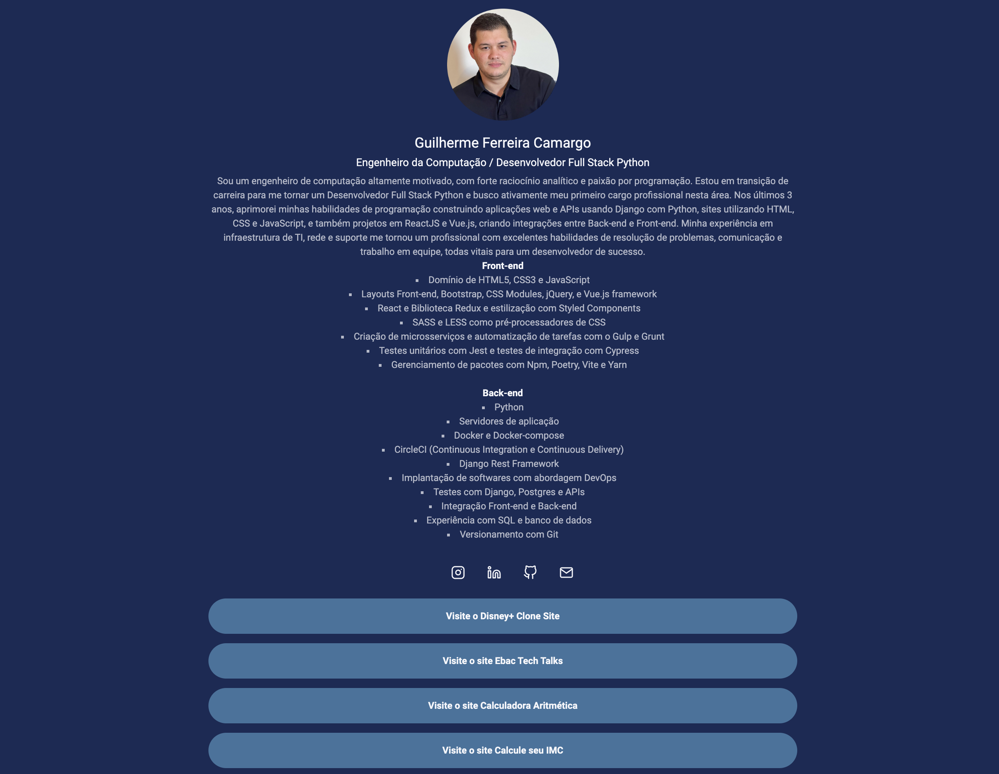

# About me Page

Projeto apresenta meu portfólio com foco na aplicação do pré-processador de CSS **LESS**.  Com uso de Mixins, Maps,
Escapings, variáveis e divisão dos arquivos. E utilização do **Bootstrap** para criação de Modal como formulário
e **jQuery** para validação de campos.

Projeto desenvolvido no curso de Full Stack Python da EBAC - Escola Britânica de Artes Criativas e Tecnologia.

## 🚀 Começando

Estas instruções permitirão que você obtenha uma cópia do projeto em execução em sua máquina local para fins de
desenvolvimento e teste.

### Pré-requisitos

Antes de começar, certifique-se de ter as seguintes ferramentas instaladas em sua máquina:

- **Node.js**
- **npm (geralmente vem com o Node.js)**
- [VSCode](https://code.visualstudio.com/)
- [Live Server](https://github.com/ritwickdey/vscode-live-server-plus-plus)

### Instalação

Siga estas etapas a seguir para configurar o ambiente de desenvolvimento:

1. Clone este repositório em sua máquina local.
2. Navegue até o diretório clonado.
3. Instale a extensão [Live Server] no VSCode.
4. Com arquivo HTML principal aberto, clique em "Go Live" no canto inferior direito do VSCode para executar o projeto.
3. Execute o seguinte comando para instalar as dependências:

  **``npm install``**

### Executar o projeto

No arquivo package.json, na chave "scripts", é possível designar os comandos desejados para execução do projeto em
ambiente de desenvolvimento e produção. Neste caso, o mesmo comando foi designado para os dois ambientes.

    "scripts": {
      "less": "less-watch-compiler ./src/styles ./build/styles/ main.less",
      "test": "echo \"Error: no test specified\" && exit 1"
    },

  **``npm run less``**

A pasta "build" será criada com os arquivos para produção.

## 🛠️Ferramentas utilizadas para construção do projeto

* **HTML** - Linguagem de marcação utilizada na construção de páginas na Web.
* **CSS** - Cascading Style Sheets é um mecanismo para adicionar estilos a uma página web.
* **jQuery** - Biblioteca livre que contém funções de JavaScript que interage com páginas em HTML.
* **Bootstrap** - Framework web open-source para desenvolvimento de componentes de interface para sites e aplicações web.
* **LESS** - Pré-processador para CSS, framework fácil, flexível e dinâmico para desenvolvimento web.
* **NPM** - Gerenciador de pacotes padrão para o ambiente de tempo de execução JavaScript Node.JS.

## ✒️ Autor

Guilherme Ferreira Camargo
